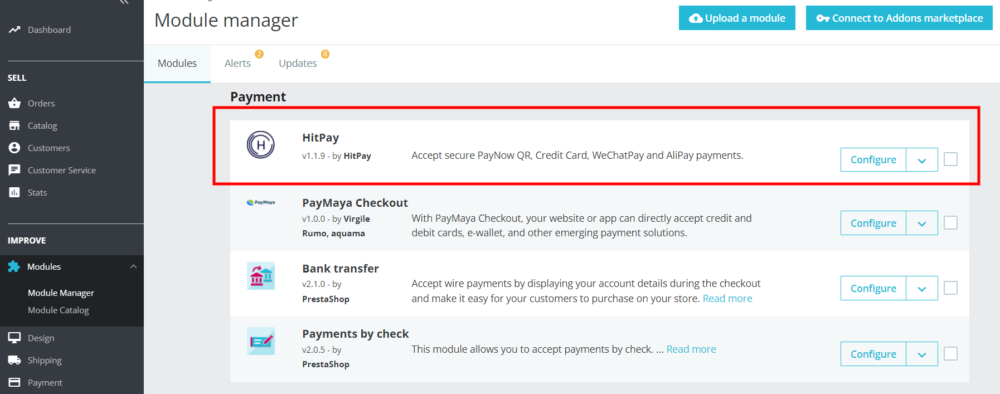
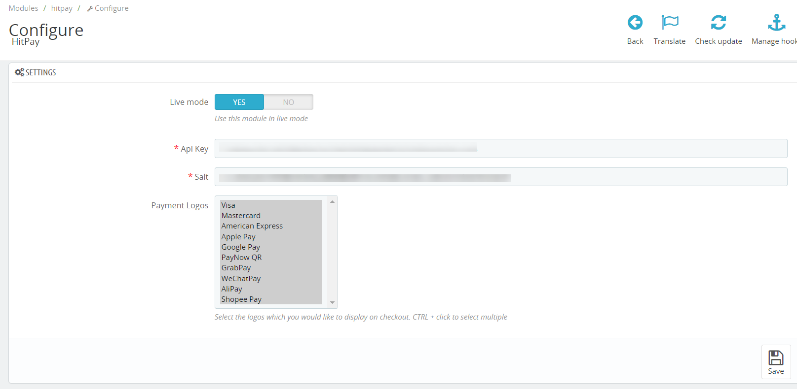
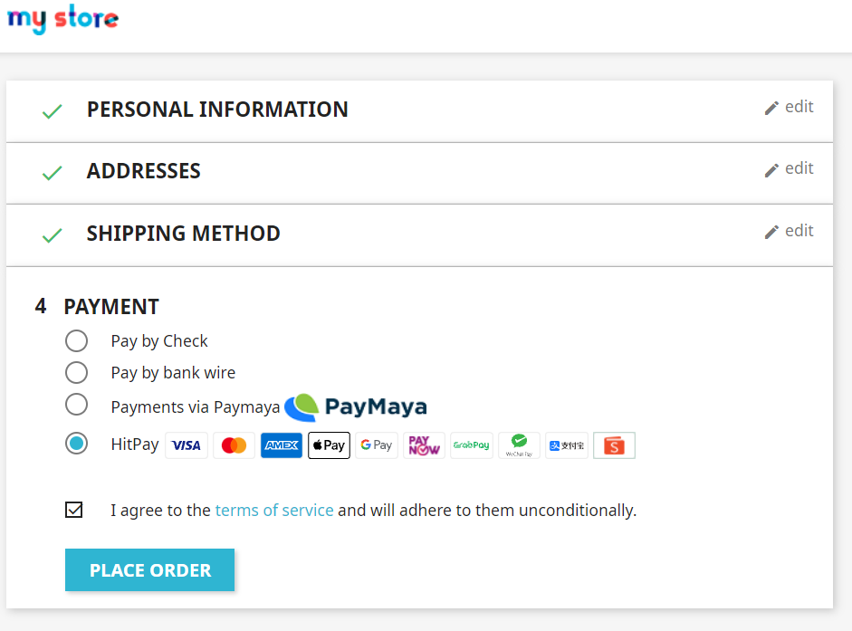
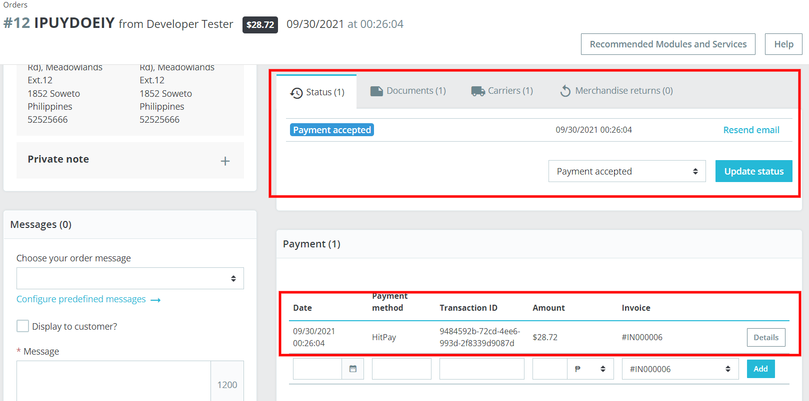

# HitPay 

## Installing

1. Need to download the repository
2. Execute:
```shell
cd path/to/project/modules/hitpay;
composer install;
```
if you update the module, need to execute:
```shell
cd path/to/project/modules/hitpay;
composer update;
```
3. Go to admin page:

4. Click on install button

## Configuration
1. Go to prestashop configuration page:

2. Go to dashboard of hitpay:


3. Copy api key and salt from hitpay dashboard to prestashop module in the same named fields

## Using

1. Payment

2. Checking orders
